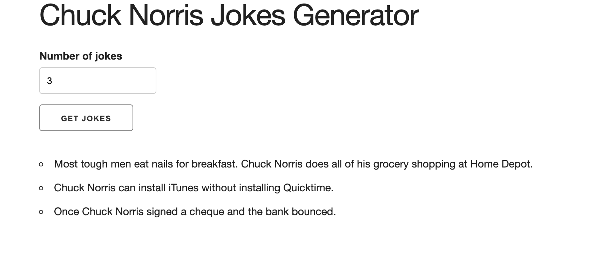

# NorrisJoke

Small Web app with Vanilla JS. Works with an external API.
- Fetch Data(jokes) from icndb.com
- Display it on the ui.

## Technology used

- Skeleton Css
- Javascript

## Live Demo

http://anvialex.me/bookListApp/

## Setup 
You can clone this repo by doing:
`git clone git@github.com:Anvi98/NorrisJoke.git`

## Author

[Anvi Alex](https://www.linkedin.com/in/anvi-alex-eponon/)

